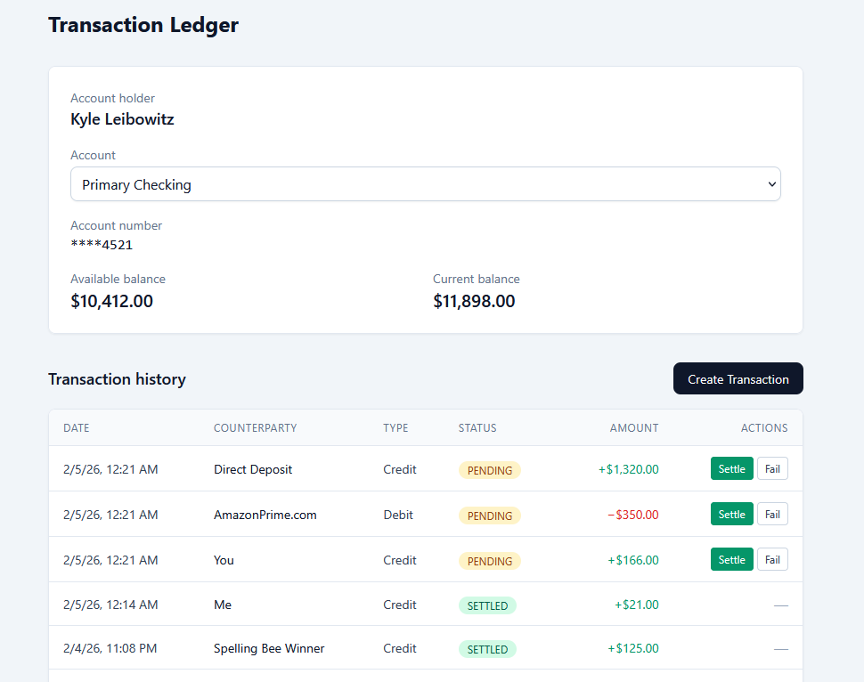

TransactionLedger is a high-integrity financial ledger service designed to manage fund movements with absolute precision. This project demonstrates a production-ready approach to tracking account balances, managing transaction lifecycles, and ensuring data consistency in a banking environment.
🚀 Core Functionality

TransactionLedger provides a centralized "System of Record" for financial activity:

    Transaction Lifecycle: Support for multiple states (PENDING, SETTLED, FAILED) to simulate real-world banking delays and clearing processes.

    Balance Management: Real-time tracking of Available Balance (liquid funds) vs. Current Balance (total funds including pending deposits).

    Atomic Operations: Guaranteed ACID compliance using PostgreSQL transactions to ensure that balances and ledger entries are always in sync.

    Precision Accounting: Implementation of fixed-point math (Decimal) to eliminate floating-point rounding errors common in financial software.

🏗️ Technical Stack

    Backend: Python 3.11+, FastAPI

    Database: PostgreSQL

    ORM: SQLAlchemy 2.0 (with Alembic for migrations)

    Validation: Pydantic v2

    Frontend: React, Vite, Tailwind CSS

🛠️ System Design & Architecture
1. Data Integrity

Every movement of funds is treated as an immutable event. The system utilizes a Transactions table as the source of truth. To ensure performance at scale, an Accounts table maintains a balance snapshot that is updated atomically alongside ledger entries.
2. State Machine Logic

Transactions follow a strict state machine to prevent invalid financial operations:

    Debits (Withdrawals): Funds are verified and "locked" immediately upon creation to prevent overdrafts.

    Credits (Deposits): Funds are recorded as PENDING and only move to the Available Balance once the transaction reaches the SETTLED state.

3. Concurrency Handling

The API utilizes Row-Level Locking (SELECT FOR UPDATE) during balance updates. This prevents race conditions—such as a user attempting to initiate two simultaneous withdrawals that exceed their available balance.
📈 Database Schema
Table	Key Fields	Purpose
Accounts	id, name, available_balance, current_balance	Tracks the real-time financial standing of the user.
Transactions	id, account_id, amount, type, status, counterparty	The immutable ledger recording every credit and debit.
🚦 Getting Started
Prerequisites

    Python 3.11+ (if running locally)

Installation

    Clone the repository:
    Bash

    git clone https://github.com/your-username/transactionledger.git
    cd transactionledger

    Start the environment:
    Bash

    Access the API:

        API: http://localhost:8000

        Interactive Docs: http://localhost:8000/docs

        Frontend Dashboard: http://localhost:3000

🔮 Future Enhancements

    Idempotency: Implementation of Idempotency-Key headers for all POST requests to safely handle network retries.

    Audit Logs: A secondary history table to track metadata changes for compliance and debugging.

    Webhooks: Outbound event notifications to alert external services when a transaction status changes to SETTLED.